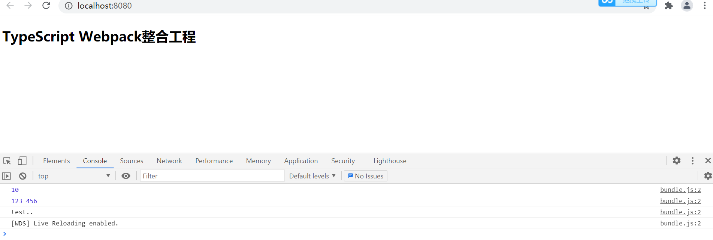

# ts-webpack
TypeScript与Webpack整合的开发示例工程，使用了的组件有：@babel/core, @babel/preset-env, babel-loader, clean-webpack-plugin, core-js, html-webpack-plugin, ts-loader, typescript, webpack, webpack-cli, webpack-dev-server。

## 使用步骤

1. 将工程install，即：

   ```
   npm install
   ```

2. 根据自己的实际需要，调整webpack.config.js和tsconfig.json配置文件，默认已经对组件进行了整合配置。

3. 运行工程，即：

   ```
   npm run start
   ```

   由于集成了webpack-dev-server组件，支持热部署，对开发阶段比较友好。运行成功后，可以看到打开浏览器页面，即：

   

4. 打包工程，即：

   ```
   npm run build
   ```

   

